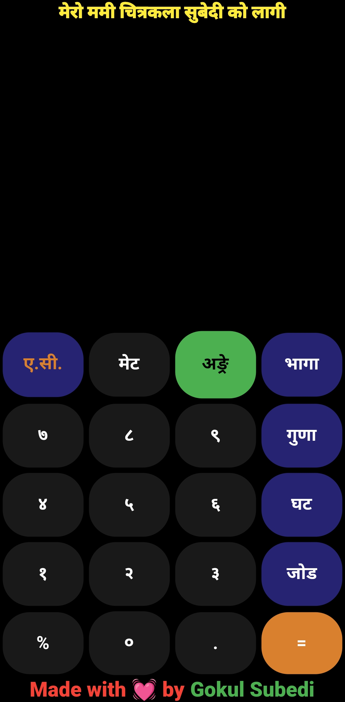
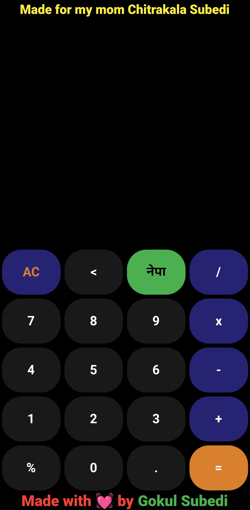

# 🧮 Bilingual Calculator (English | Nepali)

Simple, loving Flutter calculator built for my mom. Default language: **Nepali** on launch. Basic arithmetic with large, clear UI.

---

## Screenshots

Replace paths with your screenshots:


| Nepali UI | English UI |
|----------|------------|
|  |  |

---

## Features

* Basic math: `+  -  ×  ÷`
* Default locale: **Nepali** on app launch
* Toggle/switch to English
* Large buttons, readable text, accessible layout
* Offline, minimal, no telemetry

---

## Quick start

```bash
git clone <repo-url>
cd <repo-folder>
flutter pub get
flutter run
```

---

## Make Nepali the default locale

Add to `MaterialApp` (or use your localization setup):

```dart
MaterialApp(
  locale: const Locale('ne'),
  supportedLocales: const [
    Locale('ne'),
    Locale('en'),
  ],
  localizationsDelegates: const [
    GlobalMaterialLocalizations.delegate,
    GlobalWidgetsLocalizations.delegate,
    GlobalCupertinoLocalizations.delegate,
    // AppLocalizations.delegate (if using intl/gen-l10n)
  ],
  home: const CalculatorHome(),
);
```

---

## Example localization files (`lib/l10n`)

`intl_en.arb`

```json
{
  "@@locale": "en",
  "appTitle": "Calculator",
  "clear": "C",
  "equals": "=",
  "error": "Error",
  "switchLanguage": "Switch to Nepali"
}
```

`intl_ne.arb`

```json
{
  "@@locale": "ne",
  "appTitle": "क्याल्कुलेटर",
  "clear": "C",
  "equals": "=",
  "error": "त्रुटि",
  "switchLanguage": "नेपालीमा सर्छ"
}
```

---

## UX notes

* Use 56dp+ tappable buttons.
* Keep result text large and centered.
* Prefer system numerals or localized digits if your audience needs it.

---

## Attribution

Built for my mom — small app, big heart.
